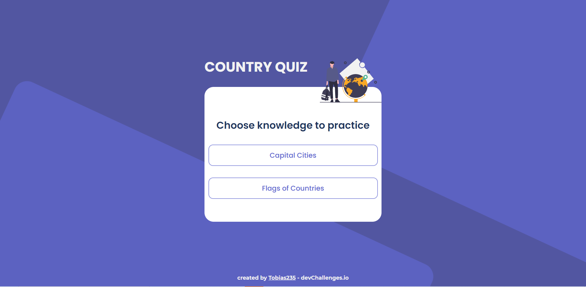

<!-- Please update value in the {}  -->

<h1 align="center">Country Quiz</h1>

<div align="center">
   Solution for a challenge from  <a href="http://devchallenges.io" target="_blank">Devchallenges.io</a>.
</div>

<div align="center">
  <h3>
    <a href="https://tobias235-countryquiz.netlify.app/">
      Demo
    </a>
    <span> | </span>
    <a href="https://github.com/Tobias235/countryQuizChallenge">
      Solution
    </a>
    <span> | </span>
    <a href="https://devchallenges.io/challenges/TtUjDt19eIHxNQ4n5jps">
      Challenge
    </a>
  </h3>
</div>

<!-- TABLE OF CONTENTS -->

## Table of Contents

- [Overview](#overview)
  - [Built With](#built-with)
- [Features](#features)
- [How to use](#how-to-use)
- [Contact](#contact)
<!-- OVERVIEW -->

## Overview



It was difficult in the beggining to know where to start but have to start at one end and finish at some. It was abit difficult to get correct answer to show up if you choose the wrong answer but after some thinking and google searches I managed to solve it. I have also never been in a situation where i needed to mix up order of an array so that was new and had to find a solution for it so it only rendered once. I felt like it was annoying to have to restart quiz every time you answer wrong so I added a limit of 10 questions and show score out of 10.

### Built With

<!-- This section should list any major frameworks that you built your project using. Here are a few examples.-->

- [React](https://reactjs.org/)

## Features

<!-- List the features of your application or follow the template. Don't share the figma file here :) -->

This application/site was created as a submission to a [DevChallenges](https://devchallenges.io/challenges) challenge. The [challenge](https://devchallenges.io/challenges/Bu3G2irnaXmfwQ8sZkw8) was to build an application to complete the given user stories.

You can choose if you want capital or flag quiz.
You can keep going until 10 questions have been answered and see score / 10.
You can see the correct answer if you choose wrong one.

## How To Use

<!-- Example: -->

To clone and run this application, you'll need [Git](https://git-scm.com) and [Node.js](https://nodejs.org/en/download/) (which comes with [npm](http://npmjs.com)) installed on your computer. From your command line:

```bash
# Clone this repository
$ git clone https://github.com/Tobias235/countryQuizChallenge

# Install dependencies
$ npm install

# Run the app
$ npm start
```

## Contact

- Website [tobias235.github.io](https://tobias235.github.io/)
- GitHub [@Tobias235](https://github.com/Tobias235)
- Twitter [@TobiasP97](https://twitter.com/TobiasP97)
